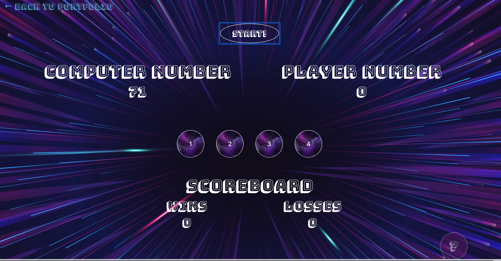
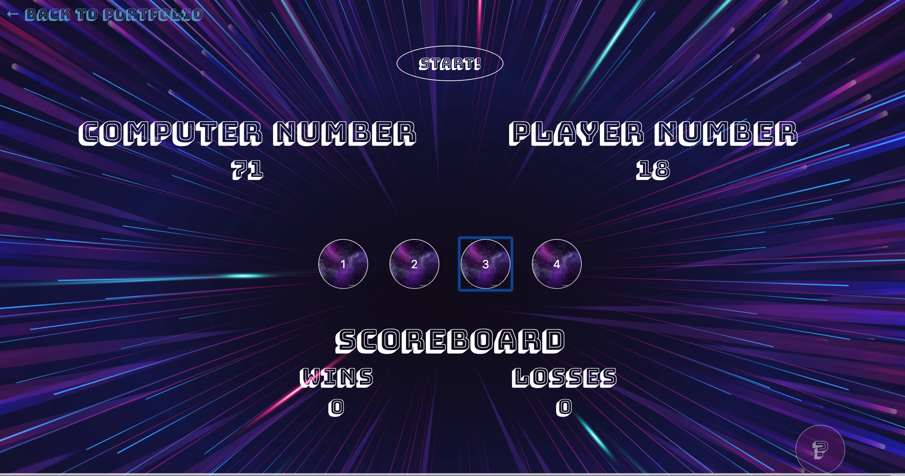
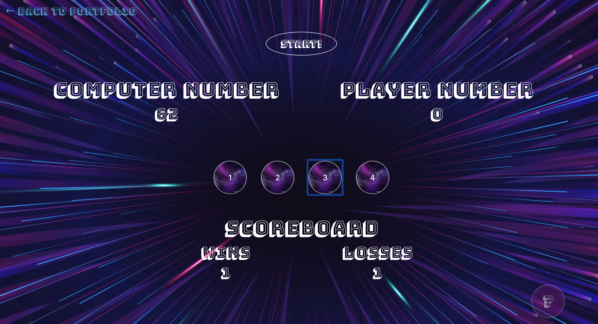

# crystal-collector

### Link to Live Game: https://emily-brown.github.io/crystal-collector/

## Game Objective:
Using the buttons that hold hidden value, score points to tie with the Computer's random number.

### Game Instructions:
1. Begin game by pressing the "Start!" button. The number will display under Computer's Number. 
2. Using the four (4) buttons, click away until your number, which is displayed under "Player Number" matches the Computer's Number. The catch is though that the values of each button are hidden and the value of each button changes every round. 
3. If you match the computer's number, you gain a point and the game resets with a new computer number and new hidden value buttons. If you go over, you lose a point and the game resets.
#### Tips
Need a refresher on game instructions? Hit the "?" button in the bottom right corner of the game screen.

## Tools/Lanugages Used:
```
  -- HTML/CSS
  -- JQuery
  -- Javascript 
  -- Bootstrap 
  -- Google Fonts 
```

## Game Features 

##### Main Game Container
```
Functionality:
  - Begin initial game hitting the "Start!" button at the top of the screen to select Computer Number. This number will display under "Computer Number"
  - Player number will display under "Player Number"
```


##### Random Hidden Value Buttons 
```
Functionality:
  - The player will use the four (4) buttons to try and get their number to match the computer number. 
  - At the start of each game, these 4 buttons will have a new set of hidden values. It's up to the player to figure out what those values are each round in order to match the computer number.
```


##### Scoreboard Container 
```
Functionality:
  - If the player gets their number to match the computer's number, they win a point and the point is captured in the "Wins" section of the scoreboard.
  - If the player's number exceeds the computer's number, the lose a point and the point is captures in the "Losses" section of the scoreboard. 
```


##### Either Win or Lose - Reset
```
Functionality:
  - After the player either wins or losses, the game will reset to clear the Player's Number, generate a new random Computer Number to match and the buttons will regenerate new hidden random values.
```

##### Instructions
```
Functionality:
  - If the player needs a reminder of the game instructions, they can click the "?" button in the right hand corner of the game.
  - Once clicked, game instructions will appear.
```

